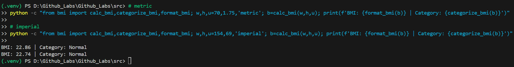
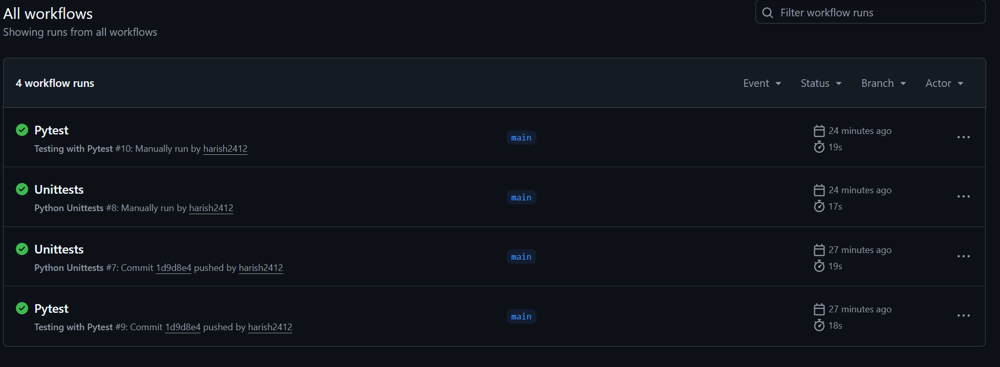

# MLOps Lab 1 – GitHub Actions, Virtual Environment, and Testing

[](https://github.com/harish2412/Github_Labs/actions/workflows/pytest_action.yml)
[](https://github.com/harish2412/Github_Labs/actions/workflows/unittest_action.yml)

---

## 🔧 Changes Made in This Assignment
| Area | Description |
|------|--------------|
| **Application** | Replaced the old `calculator.py` demo with a **BMI Calculator** (`src/bmi.py`) implementing metric & imperial support, input validation, and batch processing. |
| **Testing** | Added full **pytest suite (25 tests)** and **unittest suite (4 tests)** under the `test/` folder covering functional, edge-case, and input-validation scenarios. |
| **Project Structure** | Cleaned up repository and followed a proper MLOps layout: `src/`, `test/`, `.github/workflows/`, `.venv`, and `.gitignore`. |
| **Automation** | Implemented two **GitHub Actions workflows**: one for pytest (`pytest_action.yml`) and one for unittest (`unittest_action.yml`), both running automatically on each push/PR. |
| **Validation Enhancements** | Added checks for invalid units, unreasonable heights/weights, and boolean inputs. |

---

## 📁 Repository Structure
```
Github_Labs/
│
├── .github/
│   └── workflows/
│       ├── pytest_action.yml
│       └── unittest_action.yml
│
├── src/
│   ├── __init__.py
│   └── bmi.py
│
├── test/
│   ├── test_pytest.py
│   └── test_unittest.py
│
├── requirements.txt
└── README.md
```

---

## ⚙️ Setup Instructions (Windows / PowerShell)

```powershell
# 1. Create and activate a virtual environment
python -m venv .venv
. .\.venv\Scripts\Activate.ps1

# 2. Install dependencies
pip install -r requirements.txt

# 3. Run all tests
python -m pytest -q
python -m unittest discover -s test -p "test_unittest.py" -v
```

---

## 🤖 Continuous Integration (GitHub Actions)
Both workflows run automatically on every push to `main` and on every pull request.

| Workflow | Trigger | Runs | Output |
|-----------|----------|-------|--------|
| **Pytest** | Push / PR / Manual | `python -m pytest -q --junitxml=pytest-report.xml` | Uploads report as `pytest-results` artifact |
| **Unittest** | Push / PR / Manual | `python -m unittest discover -s test -p "test_unittest.py" -v` | Prints test summary to logs |

---

## 🧮 BMI Application Overview

| Function | Description |
|-----------|--------------|
| `calc_bmi(weight, height, unit)` | Computes BMI (metric or imperial). |
| `categorize_bmi(bmi)` | Classifies BMI into *Underweight*, *Normal*, *Overweight*, or *Obesity*. |
| `format_bmi(bmi, decimals)` | Rounds BMI to a chosen decimal precision. |
| `batch_bmi(rows, unit)` | Processes multiple (weight, height) entries and returns results with categories or error messages. |
| `validate_inputs(weight, height, unit)` | Checks for valid ranges and types to prevent unit confusion. |

Example quick run:
```python
from src.bmi import calc_bmi, categorize_bmi, format_bmi

bmi = calc_bmi(70, 1.75, "metric")
print(format_bmi(bmi), categorize_bmi(bmi))
# Output: 22.86 Normal
```

---

## ✅ Local Test Summary
| Framework | Tests | Status |
|------------|--------|--------|
| **pytest** | 25 tests | ✅ All Passed |
| **unittest** | 4 tests | ✅ All Passed |

---

## 📊 GitHub Actions Results
Latest runs (from [Actions tab](https://github.com/harish2412/Github_Labs/actions)):
- 🟢 **Pytest:** Passed – all 25 tests  
- 🟢 **Unittests:** Passed – all 4 tests  
- Both workflows run automatically on push and manually via *Run workflow*.

---


